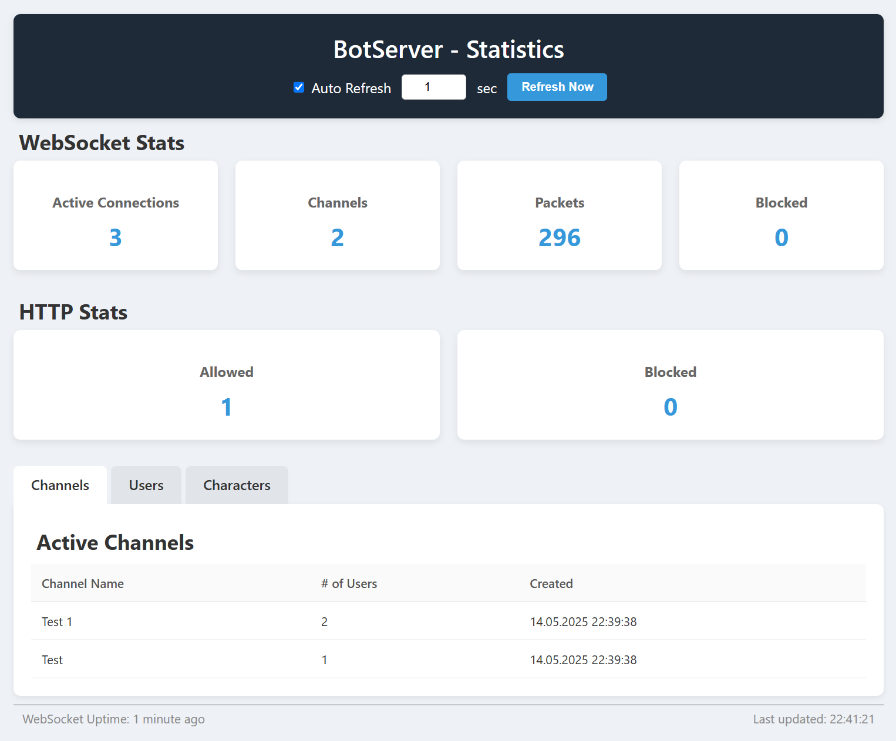
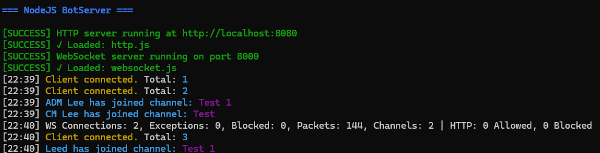

# NodeJS BotServer

A modular and extensible BotServer server inspired by [otcv8botserver](https://github.com/OTCv8/otcv8botserver), built with Node.js.

This server includes:
- 📡 A WebSocket interface for bot communication  
- 🌐 An optional HTTP web UI for real-time monitoring  
- 🧩 Modular architecture (just drop modules into `/modules`)  
- 🪵 Optional logging to `logs/output.log`  
- 🔧 Auto-installs missing dependencies on first run  
---
## 🔗 Links

- 🌐 [Website](https://www.trainorcreations.com)
- 💬 [Discord](https://trainorcreations.com/discord)
- 💖 [Donate](https://trainorcreations.com/donate)

---

## 📦 Requirements

- [Node.js](https://nodejs.org/)

---

## ⚙️ Setup

1. **Download & Install Node.js**
   - Install it from [nodejs.org](https://nodejs.org/)

2. **Run the Server**
   - Launch `start-server.bat`
   - Automatically installs dependencies on first run

3. **Logging**
   - All console output (stdout & errors) is logged to `logs/output.log`
   - Colors are stripped from log files for clean reading

> 💡 **Optional:**  
> Don’t want the HTTP Web UI or logging?
> - Disable the web interface: rename `modules/http.js` → `modules/http.js.disabled`  
> - Disable logging to file: rename `modules/a-logger.js` → `modules/a-logger.js.disabled`

---

## 🤖 vBot Integration

1. Open `_Loader.lua`
2. Add the following at the top:
   ```lua
   BotServer.url = "ws://localhost:8000/" -- add this line
   -- load all otui files, order doesn't matter
   ```
## 📤 Sending Character Info (Lua)

To allow the server to register your character data, you can send character information from your bot using a Lua script.

Add the following to your bot script (e.g., inside a Macro):
   ```lua
   macro(10000, "Send Char Info", function()
     if not BotServer._websocket then return end
   
     BotServer.send("char_info", {
       name       = player:getName(),
       level      = player:getLevel(),
       vocation   = player:getVocation(),
       health     = player:getHealth(),
       maxHealth  = player:getMaxHealth(),
       mana       = player:getMana(),
       maxMana    = player:getMaxMana(),
       experience = player:getExperience(),
       expPercent = player:getLevelPercent(),
       location   = pos() and string.format("%d, %d, %d", pos().x, pos().y, pos().z)
     })
   end)
   ```

## Web UI



## WebSocket Terminal View


